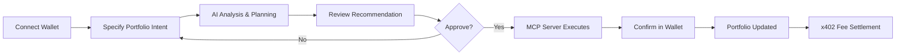

# 🌟 Astrax.ai

> **From USDT to Any** — Autonomous AI-driven portfolio management on Solana

[](https://solana.com)
[](https://www.typescriptlang.org/)
[](https://nextjs.org)
[](LICENSE)

**Astrax** is an intelligent AI agent that transforms portfolio management on Solana. Simply tell Astrax what you want—"Rebalance to 50% stablecoins, 30% SOL, 20% risk assets"—and watch it analyze, plan, and execute optimal swaps in real-time, all while keeping your private keys secure.

Built for **Solana AI Agent Hackathon 2025** 🏆

---

## 🎯 What is Astrax?

Astrax bridges **AI reasoning** with **on-chain execution** to create the first truly autonomous portfolio manager for Solana users. It combines natural language understanding, market analysis, risk assessment, and secure transaction execution into a seamless conversational experience.

**The Vision:** Evolve from crypto-only portfolios to managing **any asset class**—cryptocurrencies, equities, ETFs, and traditional financial instruments—all through one intelligent agent.

---

## ✨ Key Features

### 🧠 **AI-Driven Portfolio Rebalancing**
Talk to Astrax in plain English. No need to understand technical jargon or manually calculate swap ratios. The AI interprets your intent, analyzes market conditions, and proposes the optimal rebalancing strategy.

**Example:**
```
You: "Rebalance my portfolio to 50% stablecoin, 30% SOL, and 20% high-risk tokens"
Astrax: "Analyzing current holdings... Proposing swap plan:
         • Sell 5.2 BONK → Buy 50 USDC
         • Keep 2.5 SOL (already 30%)
         • Buy 0.8 JTO with remaining USDT
         Estimated fees: 0.05 SOL | Confirm?"
```

### 📊 **Real-Time Asset Analysis**
- Fetches live balance data from Solana RPC
- Queries real-time prices via Jupiter API
- Calculates portfolio metrics using Modern Portfolio Theory (MPT)
- Computes Sharpe ratios and risk-adjusted returns

### 🔐 **Secure Execution via MCP Server**
The **MCP (Model Context Protocol) Server** acts as a trusted middleware layer that:
- Validates AI-generated swap instructions
- Constructs and serializes Solana transactions
- Never exposes your private keys
- Monitors transaction confirmation states

```typescript
// Example: MCP Server transaction validation
const validateSwap = async (instruction: SwapInstruction) => {
  const quote = await jupiterAPI.getQuote({
    inputMint: instruction.from,
    outputMint: instruction.to,
    amount: instruction.amount,
  });
  
  if (quote.priceImpact > MAX_SLIPPAGE) {
    throw new Error("Price impact too high");
  }
  
  return buildTransaction(quote);
};
```

### 💰 **Integrated x402 Micropayment Protocol**
Astrax implements the **x402 protocol** within the MCP Server to enable:
- Automated fee settlement per transaction
- Usage-based billing for AI recommendations
- Transparent, auditable micropayments
- Revenue sharing models for future premium features

### 🚨 **Intelligent Risk Alerts**
An LSTM-based anomaly detection model continuously monitors:
- Short-term price movements
- Sudden drawdowns in key assets
- Portfolio volatility spikes

**Proactive notifications:**
```
⚠️ Alert: SOL dropped 10% in the last hour
💡 Suggestion: Rebalance to reduce exposure?
```

### 💬 **Conversational User Experience**
Chat with Astrax like you're talking to a personal financial manager. The frontend simulates natural conversation, making portfolio management accessible to everyone—from crypto natives to traditional investors.

---

## 🚀 How It Works

### **Step-by-Step User Flow**



1. **Onboarding**
   - Connect your Phantom wallet to Astrax
   - System retrieves USDT and token balances via Solana RPC

2. **Input Preference**
   - Describe your desired allocation in natural language
   - Astrax parses your intent and classifies asset categories

3. **Analysis & Recommendation**
   - AI evaluates current holdings vs. target allocation
   - Jupiter API provides real-time swap quotes
   - Risk metrics (volatility, Sharpe ratio) are calculated
   - Rebalancing plan is presented with visual charts

4. **Confirmation & Execution**
   - Review proposed swaps, estimated fees, and price impact
   - Approve the plan
   - MCP Server validates and constructs transactions
   - Confirm via Phantom wallet

5. **Post-Execution Update**
   - Dashboard reflects new portfolio composition
   - Transaction history stored in MongoDB
   - Risk profile recalculated
   - Optional follow-up alerts if market shifts

6. **Fee Settlement (x402)**
   - Micropayments processed automatically
   - Auditable payment trail for compliance

---

## 🛠️ Technology Stack

| **Component** | **Technology** | **Purpose** |
|---------------|----------------|-------------|
| **Frontend** | Next.js, TailwindCSS, Recharts | Chat-based UI with real-time portfolio visualization |
| **Backend** | NestJS, MongoDB, Redis | API orchestration, session management, async job queue |
| **Agent** | Solana Agent Kit, TypeScript, OpenRouter | AI reasoning, portfolio optimization, blockchain operations |
| **MCP Server** | Node.js, @solana/web3.js, x402 | Secure transaction validation and micropayment processing |
| **Blockchain** | Solana, SPL Token | On-chain asset transfers and execution |
| **Data Sources** | Phantom API, Jupiter API | Wallet data and real-time market prices |
| **AI Models** | OpenRouter (GPT-4, Claude), LSTM | Natural language processing and anomaly detection |

---

## 🏆 Key Benefits

### **🔒 Security First**
- AI reasoning layer is **completely separated** from private key access
- MCP Server acts as a secure bridge with validated instructions only
- All transactions require explicit user approval via Phantom

### **🤖 True Automation**
- No manual calculations or swap executions
- AI handles complexity: slippage tolerance, route optimization, gas estimation
- Set-and-forget portfolio strategies with periodic rebalancing

### **📈 Data-Driven Decisions**
- Real-time market data integration
- Risk-adjusted recommendations using MPT and Sharpe ratios
- Historical performance tracking and analytics

### **🌐 Transparent & Auditable**
- All transactions recorded on-chain
- Complete action history in backend database
- x402 protocol ensures traceable micropayment flows

### **🔮 Future-Ready Architecture**
- Modular design allows easy extension to new asset classes
- Multi-protocol support planned (cross-chain, equities, ETFs)
- Scalable infrastructure for institutional adoption

---

## 📦 Repository Structure

This is the **main repository** for the Astrax ecosystem. The project is split into multiple specialized repos:

```
Astrax.ai/
├── frontend/          → Next.js chat interface and dashboard
├── backend/           → NestJS API server and job orchestration
├── agent/             → AI reasoning engine (Solana Agent Kit)
└── mcp-server/        → Transaction validation and x402 integration
```

### **Repository Links**

| Repository | Description | Status |
|------------|-------------|--------|
| [**Frontend**](https://github.com/ASTRAX-ai/frontend) | Chat-based portfolio UI with real-time updates | ✅ Active |
| [**Backend**](https://github.com/ASTRAX-ai/backend) | NestJS API, MongoDB, Redis queue management | ✅ Active |
| [**Agent**](https://github.com/ASTRAX-ai/agent) | AI reasoning layer built on Solana Agent Kit | ✅ Active |
| [**MCP Server**](https://github.com/ASTRAX-ai/mcp-server) | Secure transaction middleware with x402 | ✅ Active |

---

## 🎬 Quick Start

### **Prerequisites**
- Node.js >= 18
- pnpm >= 8
- Phantom wallet
- Solana CLI (optional, for advanced users)

### **Run the Full Stack Locally**

1. **Clone all repositories:**
```bash
git clone https://github.com/ASTRAX-ai/frontend.git
git clone https://github.com/ASTRAX-ai/backend.git
git clone https://github.com/ASTRAX-ai/agent.git
git clone https://github.com/ASTRAX-ai/mcp-server.git
```

2. **Setup environment variables** (each repo has `.env.example`):
```bash
# Frontend
NEXT_PUBLIC_API_URL=http://localhost:3001
NEXT_PUBLIC_SOLANA_NETWORK=devnet

# Backend
MONGODB_URI=mongodb://localhost:27017/astrax
REDIS_URL=redis://localhost:6379

# Agent
SOLANA_PRIVATE_KEY=your_base58_key
RPC_URL=https://api.devnet.solana.com
OPENAI_API_KEY=your_openrouter_key

# MCP Server
X402_WALLET_ADDRESS=your_payment_wallet
JUPITER_API_URL=https://quote-api.jup.ag/v6
```

3. **Install dependencies and start services:**
```bash
# Terminal 1: Backend
cd backend && pnpm install && pnpm run start:dev

# Terminal 2: Agent
cd agent && pnpm install && pnpm run start:consumer

# Terminal 3: MCP Server
cd mcp-server && pnpm install && pnpm run start

# Terminal 4: Frontend
cd frontend && pnpm install && pnpm run dev
```

4. **Access the app:**
Open http://localhost:3000 and connect your Phantom wallet.

---

## 🎨 Demo & Screenshots

### **Chat Interface**

*Conversational portfolio management—just type what you want*

### **Portfolio Dashboard**

*Real-time asset allocation and performance metrics*

### **Rebalancing Flow**

*AI-generated swap plan with risk analysis*

> 📹 **[Watch Live Demo Video](https://youtube.com/demo-link)**

---

## 🗺️ Roadmap

### **Phase 1: Foundation** (Current - Hackathon)
- [x] Core AI reasoning engine with Solana Agent Kit
- [x] Real-time portfolio rebalancing via Jupiter
- [x] MCP Server for secure transaction execution
- [x] x402 micropayment integration
- [x] LSTM-based risk alert system
- [x] Chat-based frontend with Phantom integration

### **Phase 2: Enhanced Intelligence** (Q1 2025)
- [ ] Advanced AI models with reinforcement learning
- [ ] Multi-strategy portfolio templates (conservative, balanced, aggressive)
- [ ] Backtesting engine for strategy validation
- [ ] Automated periodic rebalancing (weekly/monthly)

### **Phase 3: Multi-Asset Expansion** (Q2 2025)
- [ ] Integration with Bloomberg and Yahoo Finance APIs
- [ ] Support for traditional equities and ETFs
- [ ] Cross-chain capability (Ethereum, Arbitrum, Polygon)
- [ ] Commodities and forex tracking

### **Phase 4: Institutional Features** (Q3 2025)
- [ ] Multi-user portfolio management for advisors
- [ ] Premium tier with dynamic x402 fee structures
- [ ] API access for third-party integrations
- [ ] Compliance reporting and tax optimization tools

---

## 🤝 Contributing

We welcome contributions from the community! Whether you're a developer, designer, or domain expert, there's a place for you in the Astrax ecosystem.

### **How to Contribute**

1. **Pick a repository** based on your expertise:
   - **Frontend:** UI/UX improvements, new chart types
   - **Backend:** API optimization, new data sources
   - **Agent:** AI model enhancements, new reasoning strategies
   - **MCP Server:** Security audits, x402 protocol improvements

2. **Fork the repo** and create a feature branch:
```bash
git checkout -b feature/amazing-new-feature
```

3. **Make your changes** and test thoroughly

4. **Submit a Pull Request** with:
   - Clear description of changes
   - Screenshots/videos for UI changes
   - Test coverage for new features

5. **Join our community:**
   - Discord: [discord.gg/astrax](https://discord.gg/astrax)
   - Twitter: [@AstraxAI](https://twitter.com/AstraxAI)
   - Telegram: [t.me/astraxai](https://t.me/astraxai)

---

## 📄 License

This project is licensed under the **MIT License**. See [LICENSE](LICENSE) file for details.

---

## 🙏 Acknowledgments

- **Solana Foundation** for the incredible blockchain infrastructure
- **Solana Agent Kit** by SendAI for the agent framework
- **Jupiter Protocol** for seamless swap aggregation
- **Phantom Wallet** for wallet integration support
- **OpenRouter** for AI model access
- **x402 Protocol** for micropayment innovation

---

## 📞 Contact & Support

- **Website:** [astrax.ai](https://astrax.ai)
- **Email:** team@astrax.ai
- **Twitter:** [@AstraxAI](https://twitter.com/AstraxAI)
- **Discord:** [Join our community](https://discord.gg/astrax)

### **Report Issues**
Found a bug or have a feature request? Open an issue in the relevant repository:
- [Frontend Issues](https://github.com/ASTRAX-ai/frontend/issues)
- [Backend Issues](https://github.com/ASTRAX-ai/backend/issues)
- [Agent Issues](https://github.com/ASTRAX-ai/agent/issues)
- [MCP Server Issues](https://github.com/ASTRAX-ai/mcp-server/issues)

---

<div align="center">

**Built with ❤️ by the Astrax Team**

*Transforming portfolio management, one conversation at a time*

**[⭐ Star this repo](https://github.com/ASTRAX-ai) • [🚀 Try Demo](https://astrax.ai/demo) • [📖 Read Docs](https://docs.astrax.ai)**

</div>

---

## 🎯 For Hackathon Judges

### **Innovation Highlights**

1. **First Conversational Portfolio Manager on Solana**
   - Natural language interface eliminates technical barriers
   - Real-time AI reasoning with market-aware recommendations

2. **Security-First Architecture**
   - MCP Server ensures private keys never touch AI layer
   - Validated instruction pipeline with user-controlled execution

3. **Economic Sustainability**
   - x402 micropayment protocol creates sustainable agent economy
   - Usage-based billing aligned with value delivery

4. **Real-World Impact**
   - Democratizes sophisticated portfolio management
   - Bridges DeFi and TradFi with extensible architecture
   - Scalable from retail users to institutional clients

### **Technical Excellence**

- **Modular Architecture:** Clean separation of concerns across 4 specialized services
- **Production-Ready:** Comprehensive error handling, retry logic, event-driven updates
- **Performance:** Real-time processing with Redis queue management and async operations
- **Extensibility:** Plugin-based design allows rapid feature additions

### **Demo Credentials**

```
Network: Solana Devnet
Demo Wallet: (Provided in submission materials)
Test USDT: Pre-funded for judges
```

---

**Thank you for considering Astrax for Solana AI Agent Hackathon 2025!** 🚀
